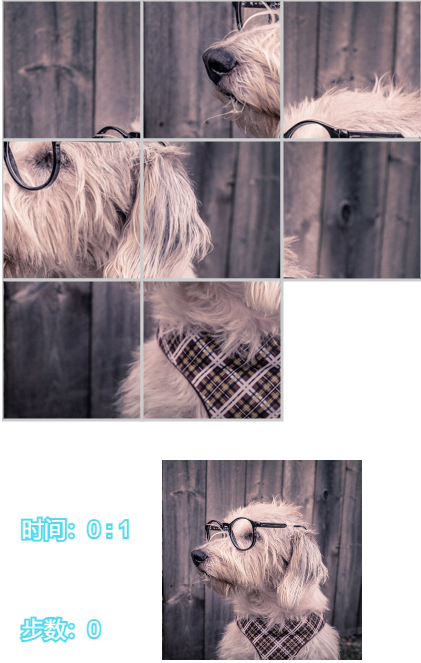

# Background

A html5 puzzle game implemented with [lufylegend](https://github.com/lufylegend/lufylegend.js).

# Install

```bash
git clone https://github.com/ChenYi015/html5-puzzle.git
```

Open ` puzzle.html` with your web browser.

```bash
docker run -d -p 8000:80 markov015/puzzle:v1.0
```

Or you can run it within docker, and open [puzzle-game](http://localhost:8000) with your web browser. 

# Screenshots

游戏开始界面：


游戏难度选择界面：


游戏画面：


